# :truck: Supply Chain Analytics - End-to-End Pipeline

> **Which product categories, customer segments, and shipping routes drive the most revenue and delivery risk - and how can we forecast future demand to reduce late deliveries and stockouts?**\
> This project uses Python, PostgreSQL, XGBoost, Facebook Prophet and Tableau to find out.

---

## :card_index_dividers: Table of Contents
- [Project Overview](#project-overview)
- [Tools & Technologies](#tools--technologies)
- [Dataset](#dataset)
- [Project Structure](#project-strcuture)
- [Key Findings](#key-findings)
- [Visualizations](#visualizations)
- [Business Recommendations](#business-recommendations)
- [How to Reproduce](#how-to-reproduce)
- [Author](#author)

---

## :mag_right: Project Overview

Supply chain performance is one of the most operationally consequential domains in data analytics - inefficiencies in delivery, pricing and demand planning translate directly into lost revenue and customer trust. This project builds a full end-to-end analytics pipeline on the DataCo Global Supply Chain Dataset using **PostgreSQL** for structured querying, **Python** for feature engineering, **Facebook Prophet** for demand forecasting and **XGBoost** for late delivery risk classification - culminating in an operational **Tableau** dashboard.

The analysis is structured across four Jupyter Notebooks:
1. Data loading, PostgreSQL ingesting and structural EDA - shape, nulls, duplicated, delivery status and market breakdowns.
2. Feature engineering - delivery delay calculation, late delivery flag, profit margin, cancellation flag discount impact and temporal date parts.
3. Demand forecasting - monthly order volume and revenue forecasting using Facebook Prophet with a 6-month forward horizon.
4. Late delivery risk classification - SGBoost classifier trained on 12 pre-delivery features, evaluated with ROC-AUC and 5-fold cross-validation.

---

## :wrench: Tools & Technologies

| Tool | Purpose |
|------|---------|
| PostgreSQL | Database storage - supply_chain_raw and supply_chain_features tables |
| DBeaver | PostgreSQL GUI and SQL query execution |
| Python (Pandas, NumPy) | Data loading, cleaning and feature engineering |
| Python (Prophet) | Monthly demand forecasting - order volume and revenue |
| Python (XGBoost) | Late delivery risk classification (GPU-accelerated, CUDA 11.8) |
| Python (Scikit-learn) | Train/tes split, cross-validation, evaluation metrics |
| Python (Matplotlib, Seaborn) | Data visualization - distributions, forecasts, confusion matrix |
| SQLAlchemy + psycopg2 | PostgreSQL - Python connection |
| Tableau Public | Operational BI dashboard |
| Jupyter Notebook | Analysis narrative and presentation |
| Git / GitHub | Version control and project hosting |

---

## :clipboard: Dataset

**DataCo Smart Supply Chain for Big Data Analysis**\
Source: [Kaggle - DataCo Supply Chain Dataset](https://www.kaggle.com/datasets/shashwatwork/dataco-smart-supply-chain-for-big-data-analysis)

| Property | Value |
|----------|-------|
| Raw rows | 180,519 order lines |
| Raw columns | 53 |
| Columns after cleaning | 45 |
| Date range | Jan 2015 - Jan 2018 (~3 years) |
| Markets | 5 - Europe, LATAM, Pacific Asia, USCA & Africa |
| Unique orders | 65,752 |
| Unique customers | 20,652 |
| Unique products | 118 |
| Duplicate rows | 0 |

**Key Variables Used:** Order Id, Customer Id, Shipping Mode, Market, Order Region, Category Name, Department Name, Sales, Order Profit Per Order, Delivery Status, Days fpr shipping (real), Days for shipping (scheduled), Order Status, order date (DateOrders), shipping date (DateOrders)

> **Note:** This is a real operational dataset from a global retailer. The dataset contains a data truncation artifact from Oct 2017 onward - monthly order counts drop sharply from ~5,100 TO ~2,000, not due to real demand decline but due to mid-collection cutoff. Prophet training was capped at Sept 2017 to prevent false learning trend. Eight columns were dropped: Product Description (100% NULL), Order Zipcode (86.24% NULL) and 6 PII columns.

---

## :pushpin: Project Structure

```
supply-chain-analytics
|
├── data/
│   ├── raw/
│       ├── DataCoSupplyChainDataset.csv
│       └── DescriptionDataCoSupplyChain.csv
│   ├── processed/
│       ├── feature_importance.csv
│       ├── forecast_order_volume.csv
│       └── forecast_revenue.csv
|
├── models/
│   ├── xgboost_label_encoders.pkl
│   └── xgboost_late_delivery.pkl
|
├── notebooks/
│   ├── 01_load_and_explore.ipynb
│   ├── 02_feature_engineering.ipynb
│   ├── 03_forecasting.ipynb
│   └── 04_risk_classification.ipynb
│
├── sql/
│   └── supply_chain_queries.sql
│
├── visualizations/
│   ├── 01_data_quality_overview.png
│   ├── 02_monthly_order_volume.png
│   ├── 03_top_categories_by_sales.png
│   ├── 04_late_delivery_by_shipping_market.png
│   ├── 05_profit_margin_analysis.png
│   ├── 06_monthly_order_volume_splits.png
│   ├── 07_order_volume_forecast.png
│   ├── 08_prophet_components_volume.png
│   ├── 09_revenue_forecast.png
│   ├── 10_confusion_matrix_roc.png
│   ├── 11_feature_importance.png
│   └── 12_late_delivery_key_features.png
│
├── README.md
```

---

## :closed_book: Key Findings

### 1. :red_circle: First Class Shipping Fails 95.32% of Orders - The Single Largest Operational Risk

| Shipping Mode | Total Orders | Late Rate | Avg Delay (days) |
|---------------|--------|-----------|------------------|
| First Class | 27,814 | **95.32%** | +1.00 |
| Second Class | 35,216 | 76.63% | +1.991 |
| Same Day | 9,737 | 45.74% | +0.478 |
| Standard Class | 107,752 | 38.07% | -0.004 |

First Class is the only mode marketed on speed, yet it delivers late on 19 out of every 20 shipments - a rate more than 57 percentage points above the overall average of 54.83%. Standard Class, by contrast, is the most reliable mode in the entire network at 38.07% late. The implication is direct - the fastest-labelled tier is the most consistently broken one.

---

### 2. :red_circle: Shipping Mode and SLA Days Alone Account for 94.3% of All Predictive Signal

| Rank | Feature | Importance |
|------|---------|------------|
| 1 | Shipping Mode | 0.4978 (49.78%) |
| 2 | Days for shipment (scheduled) | 0.4448 (44.48%) |
| 3-12 | All remaining 10 features combined | 0.0574 (5.74%) |

The XGBoost Classifier (ROC-AUC 0.7361, 5-fold CV mean 0.7348 ± 0.0025) identifies Shipping Mode and scheduled SLA days as the near-exclusive predictors for late delivery. Market, Category, Customer Segment and Discount Rate each contribute less that 0.7% of signal. This tells us that the late delivery problem is a logistics routing and SLA-setting failure - not a product, customer or regional one.

---

### 3. :red_circle: Demand is Stable and Highly Forecastable - Prophet Achieves 0.19% MAPE

| Metric | Order Volume | Revenue |
|--------|--------------|---------|
| MAE | 9.80 orders/month | $45,695.83/month |
| RMSE | 11.69 orders/month | $51,826.81/month |
| MAPE | **0.19%** | 4.12% |
| Forecast horizon | 6 months | 6 months |

Monthly order volume holds between 5,000-5,300 orders across all 33 stable months (Jan 2015 - Sept 2017), with a consistent Feb dip each year captured by Prophet's yearly seasonality component. A MAPE of 0.19% on the held-out test window indicates the series is almost entirely trend-stable and seasonally predictable - ideal conditions for inventory-linked demand planning.

---

### 4. :red_circle: Fishing is The Top Revenue Category at $6,929,653,69 - but Margin Leaders are Smaller Categories

| Category | Revenue | Profit Margin |
|----------|---------|---------------|
| Fishing | $6,929,653,69 | 10.91% |
| Cleats | $4,431,943 | 11.16% |
| Camping & Hiking | $4,118,426 | 10.38% |
| Fitness Accessories | $35,601 | **14.77%** |
| Toys | $6,105 | 14.75% |
| Soccer | $26,477 | 14.74% |

Fishing dominates revenue at 18.84% of the total but operates at a below-average margin. The highest-margin categories - Fitness Accessories (14.77%), Toys (14.75%) and Soccer (14.74%) - are low-medium niches currently discounted at the same flat 10.2% rate as every other department. This uniform discounting policy is actively suppressing margin in the categories that can afford to give the least away.

---

### 5. :red_circle: Consumer Segment Drives 51.91% of Revenue - but All Segments Share Near-Identical Margins

| Customer Segment | Revenue | Revenue Share | Profit Margin |
|------------------|---------|---------------|---------------|
| Consumer | $19,095,790 | 51.91% | 10.86% |
| Corporate | $11,168,410 | 30.36% | 10.77% |
| Home Office | $6,520,538 | 17.73% | 10.59% |

Despite the Consumer segment generating more than half of total revenue, all three segments operate within a 0.27 percentage point margin band (10.59% - 10.86%). Segment mix has no meaningful impact on profitability. Margin improvement must come from operational levers - discounting policy, shipping cost reduction and cancellation reduction - not from shifting the customer base composition.

---

### 6. :red_circle: Europe is the Largest Market and the Highest Late Delivery Risk Region

| Market | Revenue | Revenue Share | Late Rate |
|--------|---------|---------------|-----------|
| Europe | $10,872,400 | 29.56% | **55.21%** |
| LATAM | $10,277,610 | 27.94% | 54.36% |
| Pacific Asia | $8,273,744 | 22.49% | 55.05% |
| USCA | $5,066,529 | 13.77% | 54.80% |
| Africa | $2,294,453 | 6.24% | 54.59% |

Europe generates the highest revenue and also carries the highest late delivery rate of any market. All five markets cluster tightly at 54-55% late - confirming market geography is not the driver of delivery risk (the XGBoost model assigns Market only 0.6% feature importance). The late delivery problem is systemic across all regions, not concentrated in any one geography.

---

## :chart_with_upwards_trend: Visualizations

### Data Quality Overview
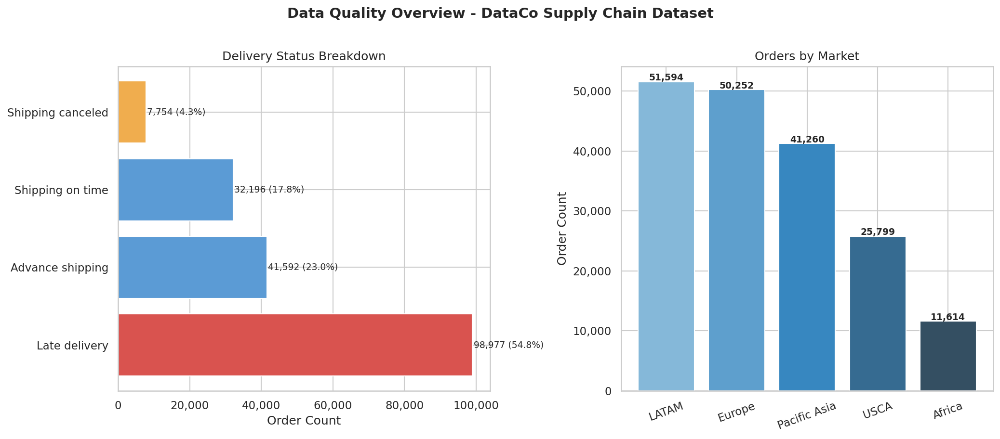

### Monthly Order Volume
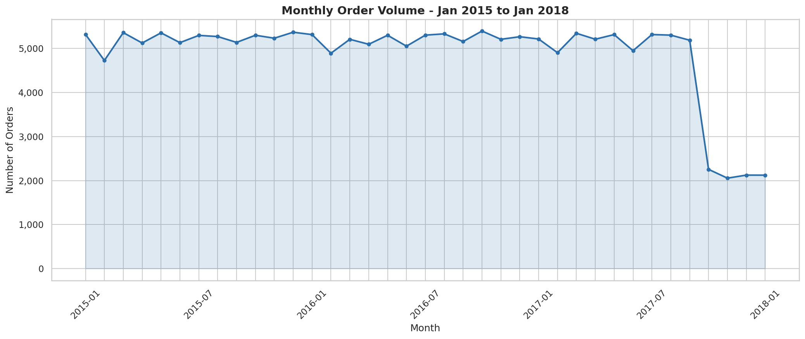

### Top 10 Categories by Sales
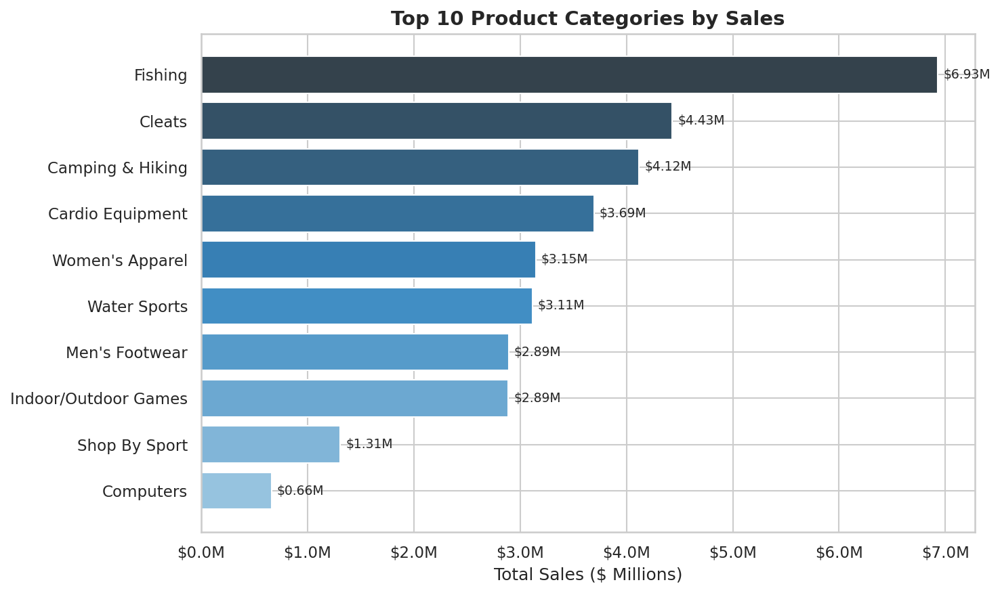

### Late Delivery by Shipping Mode and Market
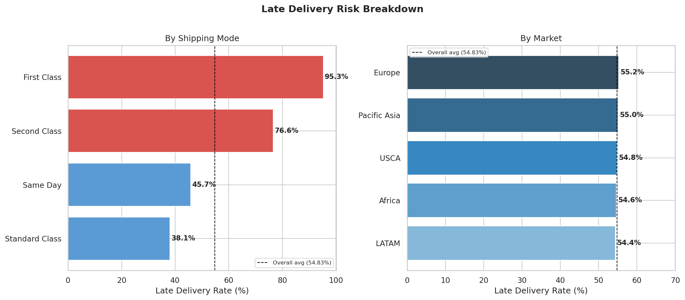

### Profit Margin Analysis
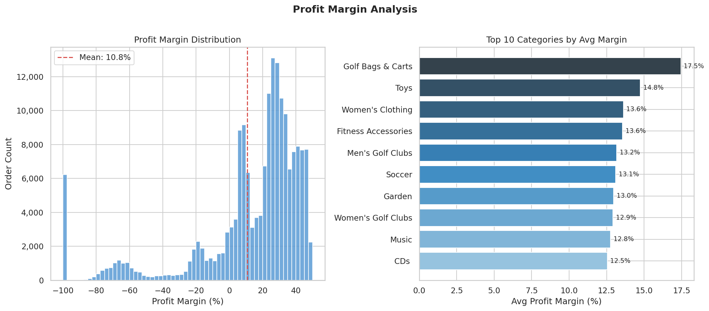

### Monthly Order Volume - Train / Test / Excluded Splits
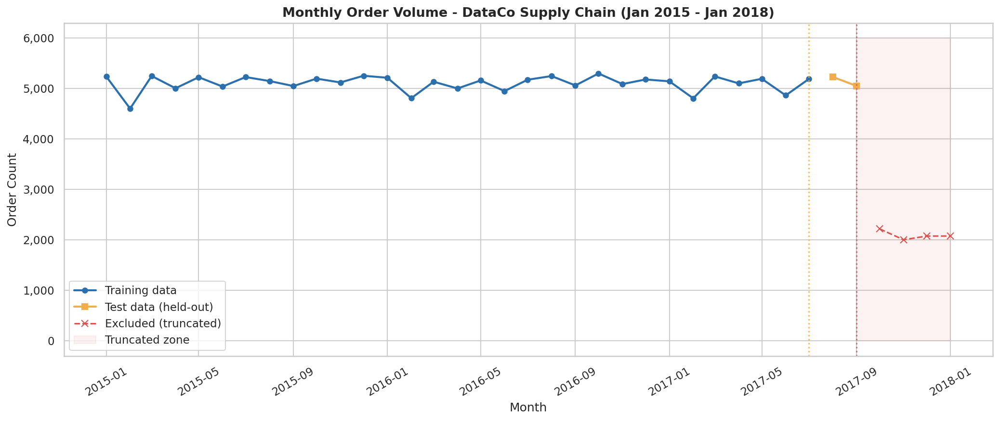

### Order Volume Forecast - Prophet (6-Month Horizon)
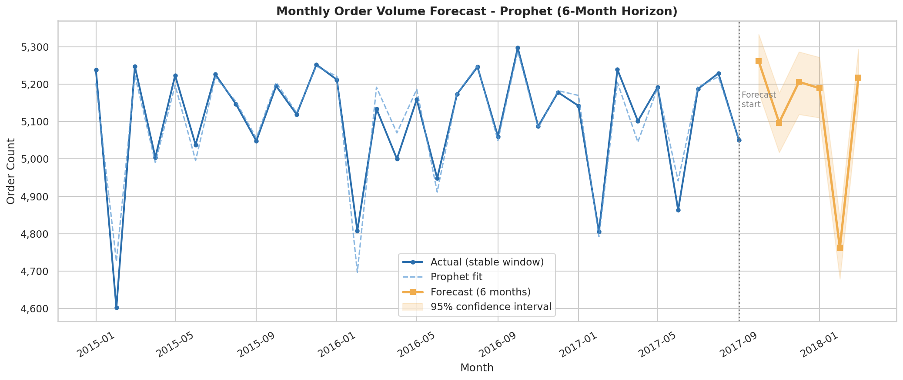

### Prophet Forecast Components - Order Volume
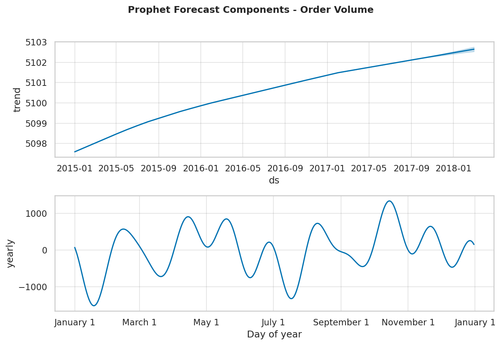

### Revenue Forecast - Prophet (6-Month Horizon)
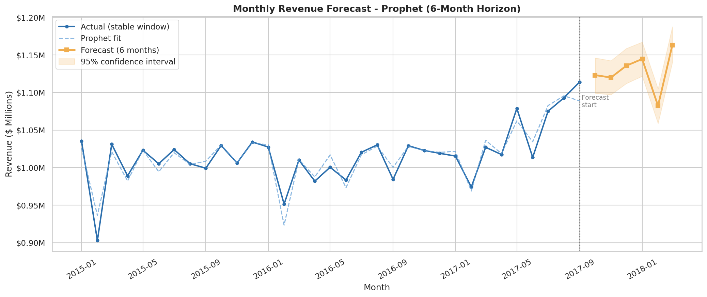

### Confusion Matrix and ROC Curve
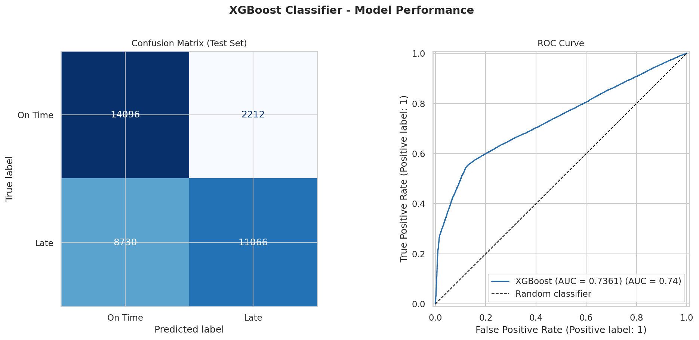

### Feature Importance - XGBoost
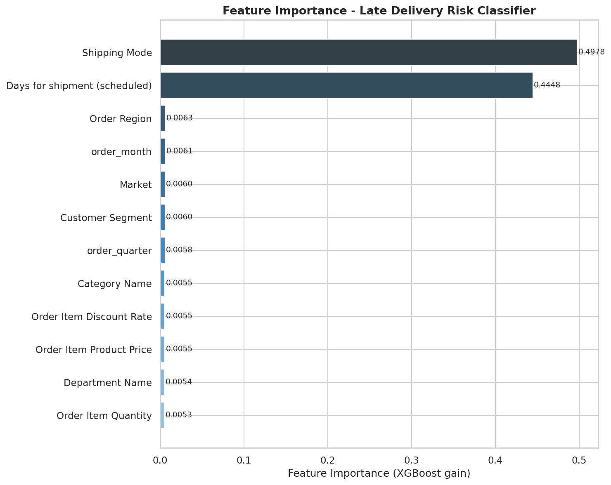

### Late Delivery Rate by Key Features
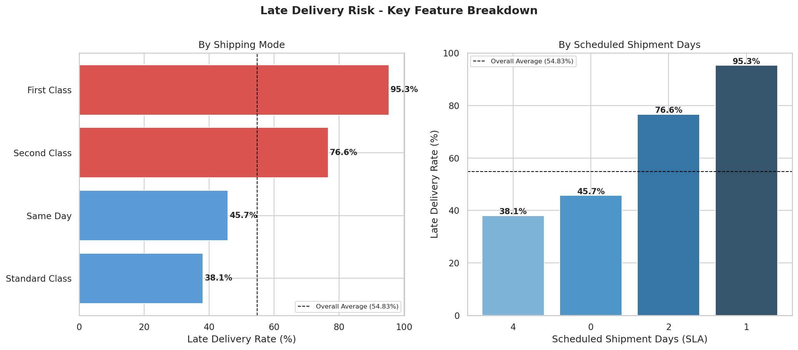

---

## :bulb: Business Recommendations

### Recommendation 1 - Audit and Suspend First Class Shipping *(Priority: Critical)*
First Class shipping fails on 95.32% of deliveries. This is not a performance gap - it is a near-total breakdown of a tier marketed on speed. An immediate root-cause audit of First Class carrier contracts and route SLAs is required. Until the underlying failure is corrected, mew orders should not be routed through First Class, and customers currently on this tier should be proactively communicated with and compensated.

### Recommendation 2 - Recalibrate SLA Windows by Mode, Region and Season *(Priority: Critical)*
Days for shipment (scheduled) is the second-strongest predictor of late delivery at 44.5% feature importance. Current SLA promises do not reflect actual carrier capacity - particularly for shorter-window modes. SLA recalibration should be conducted by shipping mode and order region, using supply_chain_features table. Promising achievable SLAs reduces late delivery risk without changing any carrier contract.

### Recommendation 3 - Restructure Discounting by Margin Band *(Priority: High)*
All 11 dependencies receive a uniform ~10.2% discount regardless of category margin. High-margin categories like Fitness Accessories (14.77%), Toys (14.75%) and Soccer (14.74%) are discounted at the same rate as near-average performers. A tiered discount policy - where high-margin categories are discounted at 5-7% and lower-margin ones at the current 10.2% - would preserve profitability in the categories best positioned to absorb less discounting. Total discount given is $3,740,585.18 - even a 2% structural reduction recovers over $74,000 annually.

### Recommendation 4 - Integrate Prophet Forecasts into Inventory Replenishment Cycles *(Priority: High)*
Monthly order volume is stable at ~5,100 orders with a MAPE of 0.19% - making this one of the most forecastable demand signals possible. This 6-month forward forecast (range: 4,762-5,261 orders/month) and the consistently low February dip identified in Prophet's seasonality component should be fed directly into inventory and procurement planning cycles. Overstocking and stockout risks are both reducible with this forecast as input.

### Recommendation 5 - Prioritize Standard Class Routing Where Customer Expectations Allow *(Priority: Medium)*
Standard Class has the lowest late delivery rate in the network at 38.07% and handles 59.7% of all orders. Where order urgency does not require expedited shipping, routing should default to Standard Class. A review of orders currently assigned to Second Class (76.63% late) that have no documented urgency requirement would identify an immediate routing optimization opportunity.

### Recommendation 6 - Conduct a Europe Logistics Review *(Priority: Medium)*
Europe is the highest=revenue market at $10,872,400 (29.56% share) and simultaneously the highest late-delivery-rate market at 55.21%. While market geography contributes little to the XGBoost model's predictions, the combination of revenue concentration and above-average delivery failure makes Europe the most commercially sensitive region for logistics intervention. A carrier-level audit of European lanes - particularly for First and Second Class routes is warranted.

---

## :computer: How to Reproduce

### Prerequisites
- PostgreSQL 15+ installed and running
- DBeaver or pgAdmin installed
- Python 3.11+ with the following packages:

```bash
pip install pandas numpy matplotlib seaborn schikit-learn xgboost prophet sqlalchemy psycopg2-binary jupyterlab
```

### Steps

**1. Clone the Repository:**
```bash
git clone https://github.com/shailendragadakari/Supply-Chain-Analytics.git
cd Supply-Chain-Analysis

**2. Set up the database:**
- Open DBeaver and connect to your local PostgreSQL instance.
- Create a new database called 'supply-chain'.
```sql
CREATE DATABASE supply_chain;
```

**3. Place the Dataset:**
- Download 'DataCoSupplyChainDataset.csv' from Kaggle.
- Place it in the 'data/raw/' folder.

**4. Run the Jupyter Notebooks 1-4 in Order:**
```bash
jupyter notebook
```

- Run '01_load_and_explore.ipynb' - loads the raw data and pushes 'supply_chain_raw' to PostgreSQL.
- Run '02_feature_engineering.ipynb' - engineers 10 features and pushes 'supply_chain_features' to PostgreSQL.
- Run '03_forecasting.ipynb' - trains Prophet models and saves forecast CSVs to 'data/processed/'.
- Run '04_risk_classification.ipynb' - trains XGBoost classifier and saves model to 'models/'.
- Update PostgreSQL connection string in each notebook to match your local credentials.

**5. Verify the Pipeline:**
```sql
-- Total row count must be 180,519
SELECT COUNT(*) FROM supply_chain_features;

-- Total revenue must be $36,784,735.01
SELECT ROUND(SUM("Sales")::NUMERIC, 2) AS total_revenue FROM supply_chain_features;

-- Late delivery rate must be 54.83%
SELECT(ROUND(AVG(late_delivery_flag) * 100::NUMERIC, 2) AS late_rate_pct FROM supply_chain_features;

-- First Class late rate must be 95.32%
SELECT "Shipping Mode", ROUND((SUM(late_delivery_flag)::NUMERIC / COUNT(*) * 100):: NUMERIC, 2) AS late_pct FROM supply_chain_features GROUP BY "Shipping Mode" ORDER BY late_pct DESC;
```

**6. Run the SQL Queries:**
- Open 'sql/supply_chain_queries.sql' in DBeaver.
- Execute all 10 queries against the 'supply_chain' database.
- Each query header contains its expected output for verification.

## :bust_in_silhouette: Author

**Shailenda Gadakari**\
B.E. Computer Science - BITS Pilani\
IBM Data Science Professional Certificate\
Microsoft Power BI Data Analyst Professional Certificate

:email: shailendragdk2701@gmail.com\
:link: [LinkedIn] (https://www.linkedin.com/in/shailendra-gadakari-b0a465332/)\
:octopus: [GitHub] (https://github.com/shailendragadakari)\
:round_pushpin: Doha, Qatar
